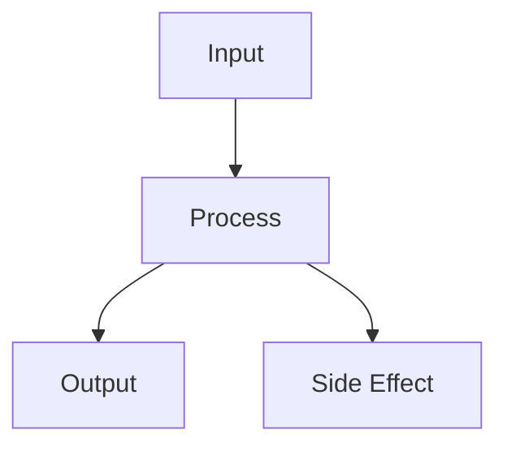

Core concepts and theory

---

# Core Concept

<div class="grid grid-cols-2 gap-8">

<div>

## Definition

Example Topic is a pattern/feature that:

- **Characteristic 1**: Brief explanation
- **Characteristic 2**: Brief explanation
- **Characteristic 3**: Brief explanation

</div>

<div>

## Key Components



</div>

</div>

---

# How It Works

```typescript {1-3|5-8|10-12}
// Step 1: Setup
const config = { option: true };

// Step 2: Implementation
function exampleFunction(input: string) {
  // Process the input
  return processedResult;
}

// Step 3: Usage
const result = exampleFunction('data');
console.log(result);
```

<div class="mt-4 p-3 bg-green-500 bg-opacity-20 rounded">
  <strong>✅ Best Practice:</strong> Always follow this pattern for consistency.
</div>

---

# Key Terminology

| Term | Definition |
|------|------------|
| **Term 1** | Brief definition of the first term |
| **Term 2** | Brief definition of the second term |
| **Term 3** | Brief definition of the third term |

<br>

<div class="p-4 bg-yellow-500 bg-opacity-20 rounded-lg">
  <strong>⚠️ Note:</strong> Understanding these terms is crucial for the exercises.
</div>
