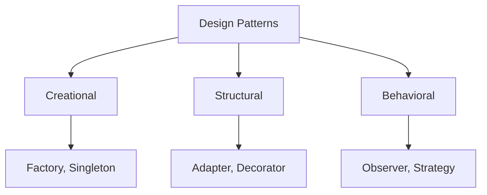

# What are Design Patterns?

Core concepts and categories

---

# Definition

<div class="grid grid-cols-2 gap-8">

<div>

## Design Patterns Are

- **Reusable solutions** to common problems
- **Templates**, not finished code
- **Best practices** distilled from experience
- **Communication tools** for teams

</div>

<div>

## Pattern Categories



</div>

</div>

---

# Common Patterns Overview

| Pattern | Category | Purpose |
|---------|----------|---------|
| **Singleton** | Creational | Ensure single instance |
| **Factory** | Creational | Create objects without specifying class |
| **Observer** | Behavioral | Notify dependents of state changes |
| **Strategy** | Behavioral | Encapsulate interchangeable algorithms |
| **Decorator** | Structural | Add behavior dynamically |

<br>

<div class="p-4 bg-green-500 bg-opacity-20 rounded-lg">
  <strong>✅ Pro Tip:</strong> Start with patterns you encounter most often in your framework.
</div>

---

# Pattern Anatomy

```typescript {1-3|5-9|11-15}
// 1. Intent: What problem does it solve?
// The Observer pattern defines a one-to-many dependency
// between objects so that when one object changes state,
// all its dependents are notified.

// 2. Structure: How is it organized?
interface Observer {
  update(data: any): void;
}

// 3. Implementation: How do you use it?
class Subject {
  private observers: Observer[] = [];

  subscribe(observer: Observer) { /* ... */ }
  notify(data: any) { /* ... */ }
}
```

